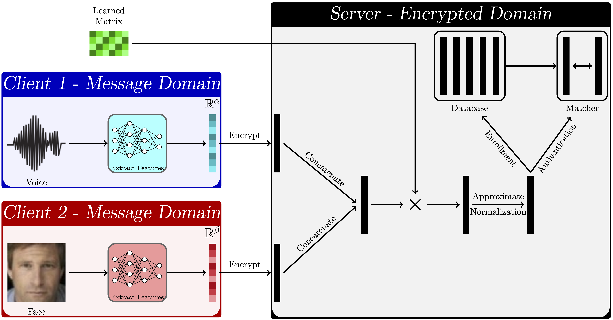

# HEFT: Homomorphically Encrypted Fusion of Biometric Templates
```BibTex
@inproceedings{
  sperling2022heft,
  title={{HEFT}: Homomorphically Encrypted Fusion of Biometric Templates},
  author={Luke Sperling and Nalini Ratha and Arun Ross and Vishnu Naresh Boddeti},
  booktitle={International Joint Conference on Biometrics (IJCB)},
  year={2022}
}
```

# Introduction



HEFT is an efficient algorithm for multimodal feature-level fusion of homomorphically encrypted biometric templates. As shown in the figure HEFT consists of four processes: concatenation of feature vectors, linear projection, approximate normalization, and match score generation. All of these operations are performed entirely in the encrypted domain. At training a disjoint train set is used in the message-space domain to learn a matrix to be used in linear projection during inference.

# Installation

SEAL 4.0.0 must be installed prior to compiling this project.
```
$ git clone --recursive https://github.com/human-analysis/encrypted-feature-fusion.git
$ cd encrypted-feature-fusion/inference
$ mkdir build; cd build
$ cmake ../
$ make clean; make
```

# Usage

Usage is split between training and inference. Training should be done prior to inference.

# Training
In order to train the model in the message-space domain:
```
$ cd train
$ python HEFT_train_voice_face.py
$ python rescale_p_matrix.py
$ python diagonal_encoding.py
```
This will produce files corresponding to the learned matrix that will be used during inference time. Both rescale_p_matrix.py and diagonal_encoding.py may be altered to select specific output p matrix files from HEFT_train_voice_face.py as opposed to what they select by default.

rescale_p_matrix.py adjusts the mean of the p matrix to ensure data samples during inference fall within the acceptable range for the polynomial approximation of inverse square root to be valid.

diagonal_encoding.py produces a diagonally-encoded matrix for use in the hybrid matrix-matrix multiplication method during inference.

# Inference
In order to perform inference-time feature-level fusion in the encrypted domain, first encrypted_feature_fusion.cpp's main method must be changed to include the p matrix filename produced from the training procedure. Replacing the X's in the function call's parameter is sufficient for this.
Then, the following may be executed:
```
$ cd inference/build
$ make
$ cd ../bin
./encrypted_feature_fusion
```
This will produce a new file in inference/results with the results.
